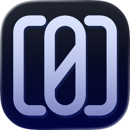
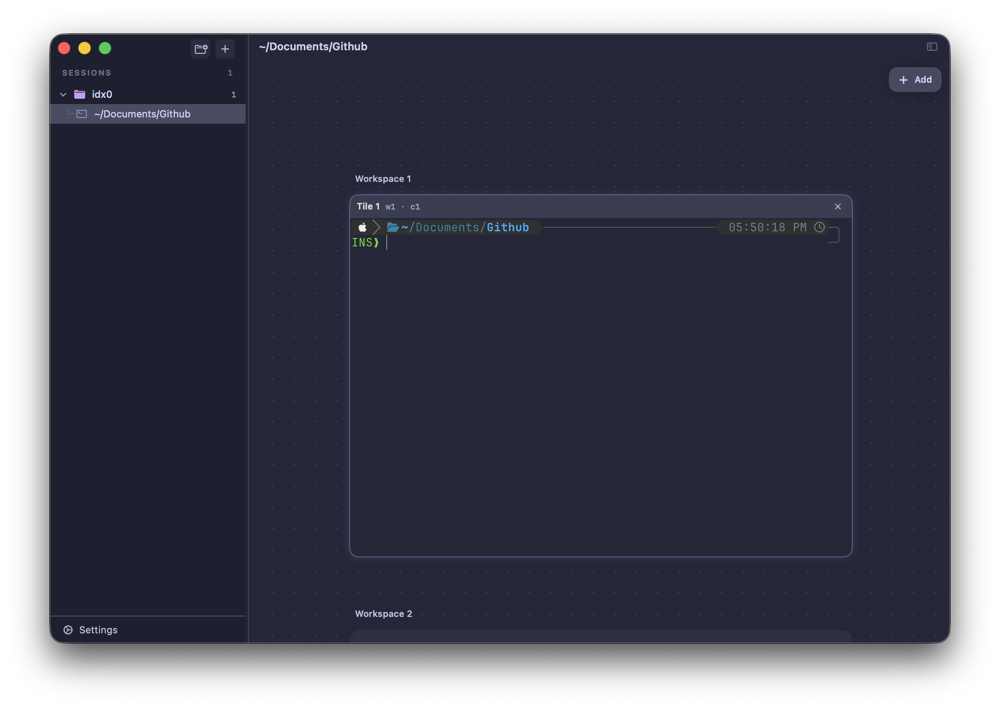
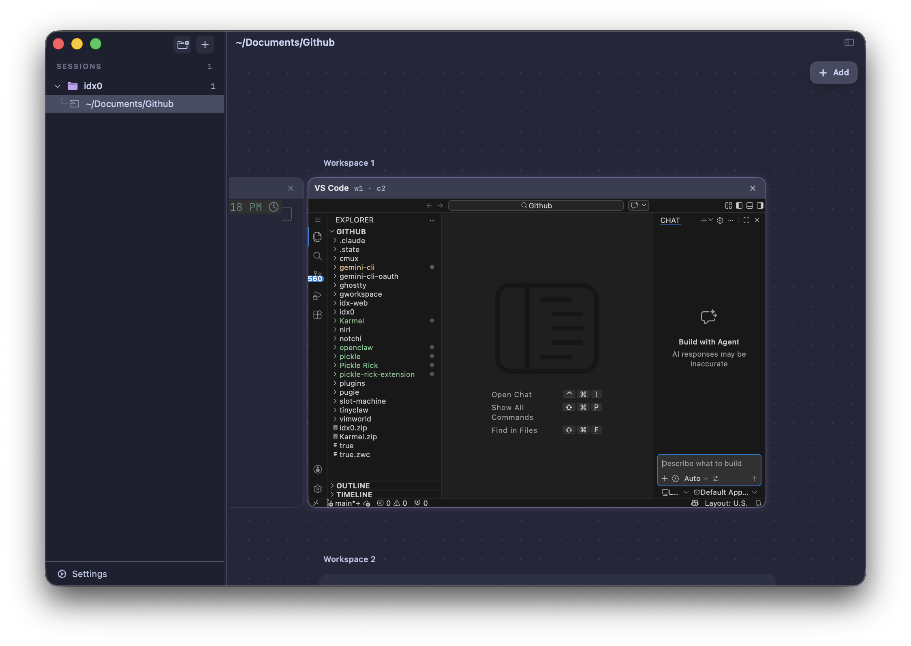
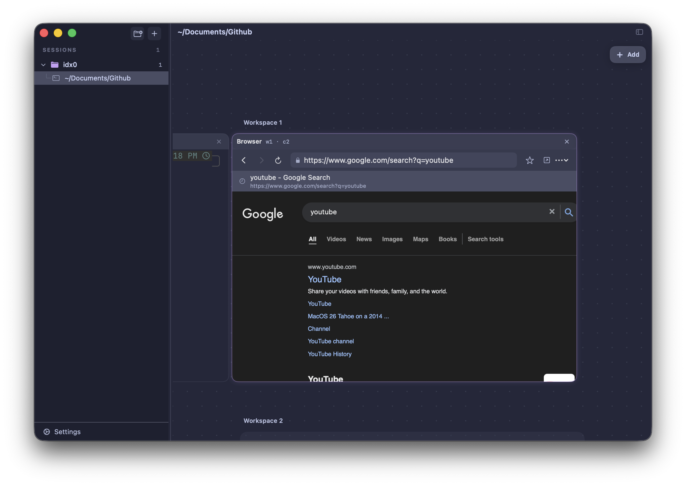

# IDX0

`IDX0` is a native macOS app for running and supervising multiple coding sessions in one place.

Think of it as a mission-control workspace for development: each session has its own terminal context, and you can add tools like a browser, VS Code, or OpenCode inside the same canvas.

## Overview

`IDX0` helps you:

- Run multiple long-lived coding sessions without losing context.
- Start work from a repo or worktree and keep each task isolated.
- Arrange terminal/browser/app tiles inside a visual workspace.
- Launch agent CLIs from the app and track what each session is doing.
- Restore your workspace state when you relaunch.

## Install (DMG)

If you want to use IDX0 without building from source, download the DMG from the release page:

- [IDX0 v0.0.1 release (DMG)](https://github.com/galz10/IDX0/releases/tag/v0.0.1)

If you prefer building from source, follow the setup steps below.

## Screenshots

Workspace with a terminal tile:



Workspace with a VS Code tile:



Workspace with an embedded browser tile:



## How People Use IDX0

1. Create a session for a task (quick terminal, repo session, or worktree session).
2. Open the tools you need in that session (terminal, browser, VS Code, OpenCode, and other tiles).
3. Run an agent CLI and keep working while IDX0 tracks session activity.
4. Save a checkpoint before major changes, then request review or create a handoff.
5. Return later and continue from the same layout and session context.

## Core Features

- Session-first workspace:
  - Create, focus, pin, rename, and restore sessions.
  - Group sessions by project and switch quickly.
- Niri mode:
  - Tile terminals, browser views, and app runtimes in flexible workspaces.
  - Use keyboard shortcuts and command palette for fast control.
- Embedded browser:
  - In-session browsing with persisted history/bookmarks and cookie import support.
- Tool launch integration:
  - Discover and launch installed CLIs like `gemini-cli`, `claude`, `codex`, `opencode`, and `droid`.
- CLI + IPC control:
  - Script and automate the app from a local `idx0` CLI.

## Requirements

- macOS 14+
- Xcode (project generated for Xcode 26.3)
- `xcodegen`
- Metal toolchain component (`xcodebuild -downloadComponent MetalToolchain`)
- `zig` (only if you need to build `GhosttyKit.xcframework` from source)

## Quick Start (Source Build)

1. Install prerequisites:

```bash
brew install xcodegen
xcodebuild -downloadComponent MetalToolchain
```

2. Set up GhosttyKit dependency:

```bash
./scripts/setup.sh
```

3. Generate the project:

```bash
xcodegen generate
```

4. Open and run:

```bash
open idx0.xcodeproj
```

Use scheme: `idx0`.

## CLI Control (Optional)

The repo includes a local CLI (`Sources/idx0`) that talks to the running app over IPC.

Common commands:

```bash
idx0 open
idx0 new-session --title "My Session" --repo /path/to/repo --worktree
idx0 list-sessions
idx0 checkpoint --session "My Session" --title "Before refactor"
idx0 request-review --session "My Session"
idx0 list-approvals
idx0 respond-approval --approval-id <uuid> --status approved
idx0 list-vibe-tools
```

IPC socket:

- `~/Library/Application Support/idx0/run/idx0.sock`

Protocol reference:

- [docs/ipc-protocol.md](docs/ipc-protocol.md)

## Contributor Docs

- [docs/README.md](docs/README.md)
- [docs/contribution-guide.md](docs/contribution-guide.md)
- [docs/style-guide.md](docs/style-guide.md)
- [docs/testing-guide.md](docs/testing-guide.md)
- [docs/architecture/deep-dive.md](docs/architecture/deep-dive.md)

## Quality Gates

```bash
# Build + tests
xcodebuild -project idx0.xcodeproj -scheme idx0 -destination 'platform=macOS' test

# Maintainability policy gate
./scripts/maintainability-gate.sh

# Core coverage gate
./scripts/coverage-core.sh
```

## Troubleshooting

- Missing GhosttyKit framework:
  - Run `./scripts/setup.sh` and confirm it ends with `==> Done`.
- Build errors for `metal`:
  - Run `xcodebuild -downloadComponent MetalToolchain`.
- CLI tools not appearing:
  - Confirm the binaries are on your shell `PATH`.
  - If launching from Xcode, verify scheme `PATH` environment values.
